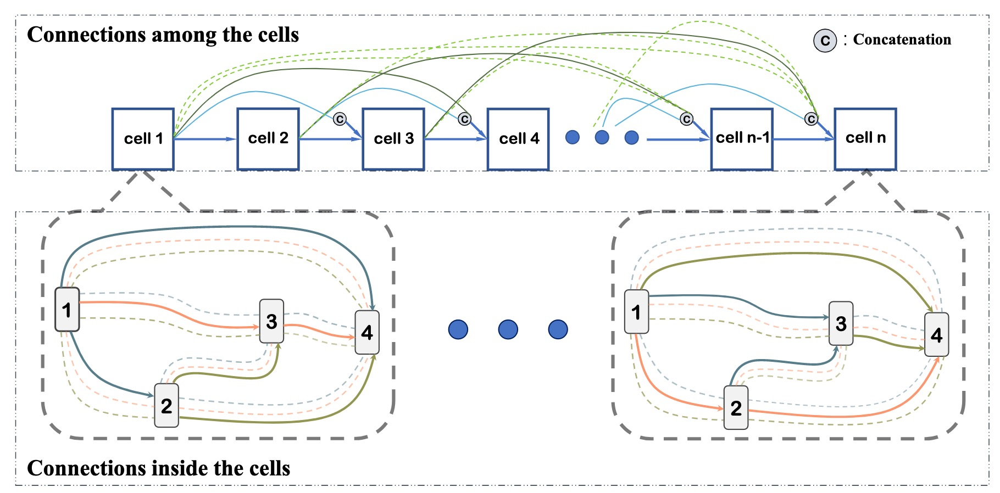

# U-DARTS

Differentiable architecture search (DARTS) is an effective neural architecture
search algorithm based on gradient descent. However, there are two
limitations in DARTS. First, a small proxy search space is exploited due to
memory and computational resource constraints. Second, too many simple
operations are preferred, which leads to the network deterioration. In this
paper, we propose a uniform-space differentiable architecture search, named
U-DARTS, to address the above problems. In one hand, the search space is
redesigned to enable the search and evaluation of the architectures in the
same space, and the new search space couples with a sampling and parameter
sharing strategy to reduce resource overheads. This means that various cell
structures are explored directly rather than  cells with same structure are
stacked to compose the network. In another hand, a regularization method,
which takes the depth and the complexity of the operations into account, is
proposed to prevent network deterioration.

# Requirements
```
Python >= 3.5.5, PyTorch == 0.3.1, torchvision == 0.2.0
```

# Train and test
We will first train on CIFAR10 to search an architecture 
``` python
python SD_trai_search.py --auxiliary --batch_size 64 --cutout
```

Then we can train and test on CIFAR10
``` python
python SD_trai.py --auxiliary --batch_size 64 --cutout
````